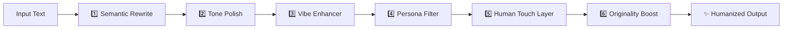

<div align="center">

# 🧠 AI Humanizer

### Transform Machine-Generated Text into Natural, Human Writing

[](https://www.python.org/)
[](https://streamlit.io/)
[](https://huggingface.co/)
[](https://www.nltk.org/)

**AI Humanizer** is a powerful Python-based text enrichment tool that transforms machine-generated writing into genuinely human text — warm, expressive, varied, and meaningful. It refines paragraphs so ideas feel natural and engaging, not mechanical.

[Features](#-features) • [Installation](#️-installation) • [Usage](#-usage) • [How It Works](#-how-it-works) • [Roadmap](#-roadmap)

</div>

---

## 🌟 Features

<table>
<tr>
<td width="50%">

### 🎨 **Style Controls**
- 🗣️ **Tone Variants**: neutral, casual, formal, playful
- 💫 **Vibe Intensity**: low, medium, high energy levels
- 🧍 **Persona System**: teacher, blogger, mentor, storyteller

</td>
<td width="50%">

### ✨ **Smart Enhancement**
- ❤️ **Human Touch Layer**: natural rhythm & flow
- 🎭 **Originality Boost**: creative metaphors & analogies
- 📖 **Readable Output**: conversational & relatable

</td>
</tr>
</table>

---

## 🗂️ Project Structure

```
ai_humanizer/
│
├── 📱 app.py                    # Streamlit web interface
├── 📋 requirements.txt          # Dependency list
├── 📘 README.md                 # Documentation
│
├── 🧠 humanizer/                # Core logic modules
│   ├── __init__.py
│   ├── main.py                  # Pipeline orchestration
│   ├── semantic.py              # Meaning-preserving rewrite
│   ├── style.py                 # Tone and readability polish
│   ├── originality.py           # Creative metaphors & analogies
│   ├── vibe.py                  # Hooks, rhetoric, punchlines
│   ├── persona.py               # Persona voices
│   └── human_touch.py           # Deep humanization layer
│
└── 🧪 tests/
    └── test_basic.py            # Unit tests
```

---

## ⚙️ Installation

### Prerequisites


### Setup Steps

**1. Clone the repository**
```bash
git clone https://github.com/yourusername/ai_humanizer.git
cd ai_humanizer
```

**2. Create and activate virtual environment**

<table>
<tr>
<td><b>🐧 macOS/Linux</b></td>
<td><b>🪟 Windows</b></td>
</tr>
<tr>
<td>

```bash
python -m venv .venv
source .venv/bin/activate
```

</td>
<td>

```bash
python -m venv .venv
.venv\Scripts\activate
```

</td>
</tr>
</table>

**3. Install dependencies**
```bash
pip install -r requirements.txt
```

**4. (Optional) Download NLTK data**
```python
import nltk
nltk.download('wordnet')
```

---

## 🚀 Usage

### Launch the Streamlit App

```bash
streamlit run app.py
```

Once started, open your browser to `http://localhost:8501` and start humanizing!

### 💻 Example Transformation

<table>
<tr>
<th>📥 Input</th>
<th>📤 Output</th>
</tr>
<tr>
<td>

```text
Artificial intelligence is 
changing how people learn.
```

</td>
<td>

```text
🔥 Here's the thing: AI is reshaping 
how we learn — and honestly, that's 
the wild part. Imagine this as the 
beginning of a journey. It's almost 
like jazz — imperfect but full of 
hidden rhythm. And that's where 
the magic happens.
```

<sub>**Settings**: Playful tone • Medium vibes • Storyteller persona</sub>

</td>
</tr>
</table>

---

## 🔧 Configuration Options

| Setting | Options | Description |
|---------|---------|-------------|
| **🎨 Tone** | `neutral` `casual` `formal` `playful` | Sets the writing mood |
| **⚡ Vibe Intensity** | `low` `medium` `high` | Controls energy & liveliness |
| **👤 Persona** | `teacher` `blogger` `mentor` `storyteller` `neutral` | Adapts voice to role |
| **❤️ Human Touch** | `enabled` `disabled` | Adds rhythm & natural flow |

All options are configurable through the intuitive Streamlit interface.

---

## 🧠 How It Works

The AI Humanizer processes text through a sophisticated **6-layer pipeline**:



### Pipeline Stages

| Layer | Function | Technology |
|-------|----------|------------|
| **1. Semantic Rewrite** | Paraphrases while preserving meaning | 🤗 Transformers |
| **2. Tone Polish** | Adjusts mood and readability | NLTK + Custom rules |
| **3. Vibe Enhancer** | Injects hooks & rhetorical flourishes | Pattern matching |
| **4. Persona Filter** | Adapts style to chosen role | Template system |
| **5. Human Touch** | Refines rhythm & adds expressions | Linguistic analysis |
| **6. Originality Boost** | Creative & metaphorical highlights | NLP techniques |

Each layer is **modular** — customize or extend any component to craft your unique voice.

---

## 🧪 Testing

Run the test suite to ensure everything works:

```bash
pytest tests/
```

Expected output:
```
================================ test session starts ================================
tests/test_basic.py .                                                        [100%]
================================= 1 passed in 0.5s =================================
```

---

## 🛠️ Tech Stack

<div align="center">

| Category | Technologies |
|----------|-------------|
| **Language** |  |
| **Web Framework** |  |
| **NLP Libraries** |   |
| **Testing** |  |

</div>

---

## 🧭 Roadmap

- [ ] **Custom Personas** — Load persona configurations from JSON/YAML
- [ ] **Humanization Depth** — Adjustable light/medium/deep processing
- [ ] **Extended Tone Palettes** — Academic, motivational, poetic, humorous
- [ ] **FastAPI REST Service** — Deployable API endpoint
- [ ] **TTS Integration** — Voice narration for audio output
- [ ] **Batch Processing** — Handle multiple documents at once
- [ ] **Export Formats** — Save as PDF, DOCX, HTML

---

## 💡 Use Cases

- 📝 **Content Creation** — Enhance blog posts and articles
- 🎓 **Education** — Make learning materials more engaging
- 💼 **Business** — Humanize automated customer communications
- ✍️ **Writing Assistance** — Polish drafts and overcome writer's block
- 🤖 **AI Content** — Make AI-generated text feel authentic

---

## ❤️ Vision

> **Writing shouldn't just inform — it should feel.**

AI Humanizer transforms lifeless drafts into words that sound like people talking, teaching, empathizing, and inspiring.

✨ Use it to **enhance** your ideas, not to conceal their source.  
💭 Your story, clarity, and compassion are what make it truly **human**.

---

## 📄 License

Open for personal and educational use.

⚠️ Please review licenses of third-party libraries (🤗 Transformers, Streamlit, NLTK) before commercial deployment.

---

## 🤝 Contributing

Contributions, issues, and feature requests are welcome!

1. Fork the repository
2. Create your feature branch (`git checkout -b feature/AmazingFeature`)
3. Commit your changes (`git commit -m 'Add some AmazingFeature'`)
4. Push to the branch (`git push origin feature/AmazingFeature`)
5. Open a Pull Request

---

## 🙏 Acknowledgments

- Built with [Streamlit](https://streamlit.io/) for the beautiful UI
- Powered by [Hugging Face Transformers](https://huggingface.co/transformers/)
- NLP magic by [NLTK](https://www.nltk.org/)

---

<div align="center">

### ⭐ Star this repo if you find it useful!

Made with ❤️ and ☕

[Report Bug](https://github.com/yourusername/ai_humanizer/issues) • [Request Feature](https://github.com/yourusername/ai_humanizer/issues)

</div>
